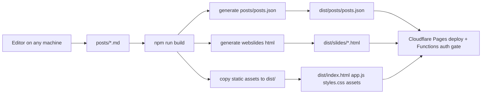

# Jerry Notes 发布系统 Design

## 1. 设计目标

本系统优先满足三个原则：

- 简单：纯静态站点，无数据库、无后端
- 单一真相：Markdown 文件是唯一内容源
- 可迁移：任意机器 clone 后即可编辑、构建、发布

## 2. 总体架构



## 3. 目录与职责

### 3.1 内容目录

- `posts/*.md`
  - 公开文章与 slides 源稿
- `posts/TEMPLATE.md`
  - 新文章模板
- `posts/posts.json`
  - 构建生成索引，供源码目录本地预览使用

### 3.2 构建脚本

- `scripts/content-utils.mjs`
  - 负责解析 front matter、校验字段、收集内容元数据
- `scripts/generate-posts-index.mjs`
  - 仅生成 `posts/posts.json`
- `scripts/build-site.mjs`
  - 产出 `dist/`
- `scripts/md-to-slides.js`
  - 把 `webslides` Markdown 生成为 HTML

### 3.3 站点运行时

- `app.js`
  - 浏览器端读取 `posts/posts.json`
  - 点击文章时拉取 `posts/<slug>.md`
  - 对 `webslides` 直接嵌入 `slides/<slug>.html`
- `functions/posts/posts.json.js`
  - 根据登录态过滤 `public / internal` 文章索引
- `functions/posts/[slug].js`
  - 对内部 Markdown 正文做服务端鉴权
- `functions/slides/[slug].js`
  - 对内部幻灯片做服务端鉴权

## 4. 内容模型

## 4.1 Front matter

推荐格式：

```md
---
title: 我的文章
date: 2026-03-17
tags:
  - AI
  - Notes
type: webslides
visibility: public
draft: false
summary: 一句话摘要
---
```

字段规则：

- `title`
  - 必填；若缺失，则回退到正文第一个 `# ` 标题
- `date`
  - 必填；格式建议为 `YYYY-MM-DD`
- `tags`
  - 可选；支持数组
- `type`
  - 可选；当前仅使用 `webslides`
- `visibility`
  - 可选；支持 `public` / `external` 与 `internal` / `private`
  - 默认 `public`
  - 如果标题或 slug 呈现出高置信度内部信号（如计划、日志、纪要、周报、学习手册、客户交流方案），构建会要求显式改成 `internal`
- `draft`
  - 可选；`true` 时跳过发布
- `summary`
  - 可选；预留给后续摘要/SEO

## 4.2 发布规则

- 只有带 front matter 的 Markdown 才会进入公开索引
- 没有 front matter 的 Markdown 视为草稿、档案或内部资料，不自动发布
- `slug` 来自文件名，不单独配置
- `visibility: internal` 的文章仅在已登录飞书用户请求时返回

## 5. 构建流程

### 5.1 `npm run generate:posts`

用途：

- 扫描 `posts/*.md`
- 解析 front matter
- 生成根目录下的 `posts/posts.json`

适用场景：

- 本地直接用仓库根目录预览时更新列表

### 5.2 `npm run build`

步骤：

1. 校验所有可发布 Markdown
2. 写入 `posts/posts.json`
3. 清空并重建 `dist/`
4. 拷贝静态资源到 `dist/`
5. 拷贝已发布的 Markdown 到 `dist/posts/`
6. 生成 `dist/posts/posts.json`
7. 为 `type: webslides` 的文章生成 `dist/slides/<slug>.html`
8. 清理无关系统文件

输出结果：

- `dist/index.html`
- `dist/app.js`
- `dist/styles.css`
- `dist/assets/*`
- `dist/posts/*.md`
- `dist/posts/posts.json`
- `dist/slides/<webslides-slug>.html`

## 6. Cloudflare Pages 集成

### 6.1 当前模式

采用 GitHub Actions + Wrangler 的 Direct Upload：

- 仓库平台：GitHub
- GitHub Actions 执行 `npm install` 与 `npm run build`
- Wrangler 上传 `dist/` 到 Cloudflare Pages 项目

优点：

- 不依赖 Pages 原生仓库集成
- 可以继续复用现有 Direct Upload 项目
- 构建过程与发布步骤都在仓库里显式可见

### 6.2 Node 版本

通过 `.node-version` 固定 Cloudflare 与本地的 Node 主版本，避免构建环境漂移。

## 7. 缓存设计

为满足“提交后较快看到新帖子”的目标，使用 Pages `_headers` 控制缓存：

- `index.html`、其他 `.html`
  - `max-age=0, must-revalidate`
- `posts/posts.json`
  - `max-age=0, must-revalidate`
- `posts/*.md`
  - `max-age=0, must-revalidate`

这样做的原因：

- 首页列表高度依赖 `posts/posts.json`
- 文章正文直接从 `posts/*.md` 拉取
- 如果这些文件缓存过久，用户会看到旧列表或旧内容

## 8. 错误处理

构建阶段直接失败的情况：

- front matter 缺少 `title`
- front matter 缺少 `date`
- 文章明显属于内部工作材料，却仍标记为 `public`

构建阶段跳过的情况：

- `draft: true`
- 无 front matter 的 Markdown

## 8.1 运行时访问控制

对于带 `visibility: internal` 的内容，Pages Functions 会在运行时做二次控制：

- 未登录请求 `posts/posts.json`
  - 自动过滤掉内部文章
- 未登录请求 `posts/<slug>.md`
  - 返回 401
- 未登录请求 `slides/<slug>.html`
  - 返回登录提示页

这样可以同时覆盖首页列表、正文直链与 slides 直链，避免只靠前端隐藏。

## 9. 取舍说明

### 9.1 为什么不做后台

需求的核心是“任意机器编辑并发布”，Git 仓库本身就是最轻量的后台。继续引入 CMS 会让维护成本超过收益。

### 9.2 为什么不立刻迁到 Astro

当前站点规模很小，现有结构足以支撑 V1 需求。先把内容流水线和部署链路跑稳，再决定是否做框架迁移，风险更低。

### 9.3 为什么把 `posts.json` 保留下来

虽然 Markdown 是唯一内容源，但前端当前通过 `posts.json` 做文章索引。保留它作为构建产物，可以不重写前端架构，同时继续满足静态托管要求。

## 10. 后续演进建议

- 用标准 Markdown 渲染库替换浏览器端手写解析器
- 根据 `summary` 自动生成列表摘要
- 增加 RSS / sitemap
- 如果文章量明显增长，再迁移到 Astro 的内容集合方案
