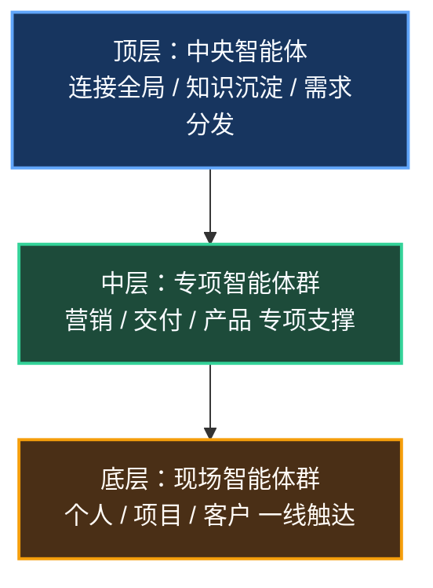
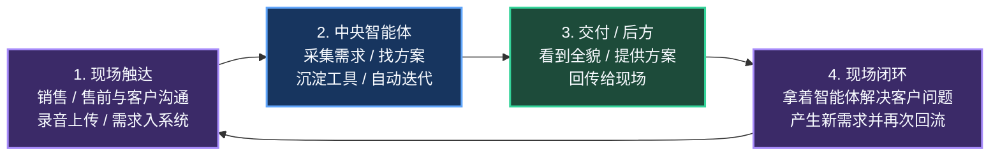
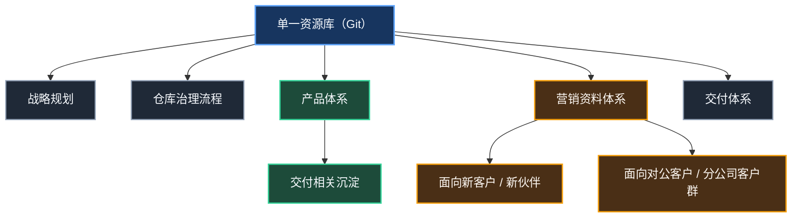

# 未来组织模式及运作模式

## 一、组织模式：三层智能体架构

### 1.1 顶层：中央智能体（核心）

#### 职责
- 连接所有员工，只要网络打通就能接入。
- 采集所有项目上的关键信息，包括：
  - 大家在做的事情
  - 碰到的问题
  - 讨论中的需求
- 维护知识体系。
- 沉淀工具。
- 持续迭代刷新。

#### 价值
- 后方能够看到全貌。
- 可以从知识体系里快速找到解决方案。
- 能够识别并沉淀可复用工具。

### 1.2 中层：专项智能体

#### 营销智能体
- 连接项目侧与产品侧的中台 / 中心仓库。
- 管理营销资料体系。
- 为销售与售前提供思路支持。

#### 交付智能体
- 沉淀交付体系。
- 从资源池提取交付资料。

#### 产品智能体
- 维护产品体系。
- 采集产品演进数据并辅助判断。

### 1.3 底层：现场智能体

#### 个人智能体
- 每个人都有一个，例如“我的虾”“我的布袋子”。
- 销售、售前、交付都可使用。
- 岗位区分逐步淡化，一个人在前场解决问题。

#### 项目级智能体
- 每个项目上部署一个。
- 它是活的，不是死软件。
- 项目相关资料在其中保持齐全。

#### 客户用智能体
- 直接给客户使用。
- 客户使用过程中产生的数据，后台要能持续采集。

---

## 二、运作模式：全链路 AI 化闭环

### 2.1 核心工作流

### 2.2 关键运作机制

#### 信息采集机制
- 录音上传：销售 / 交付与客户沟通时，录音后直接上传。
- 全量采集：同事内部沟通中没有线上化的信息，也要尽量收集。
- 目标：最高效、最完整、最精准地把所有做判断所需的信息交给 AI。

#### 资源库运作
- 单一资源库：Git，所有东西都往里放。
- 文件夹分类建议包括：
  - 产品体系（交付相关沉淀）
  - 面向新客户 / 新伙伴的资料体系
  - 面向对公客户 / 分公司客户群的资料体系
  - 战略规划、仓库治理流程等
- AI 维护规则：
  - 先与 AI 共同探讨维护规则
  - 再让 AI 自动维护、迭代、刷新
  - 如果错了，告诉它一次，第二次就不应再错
  - 自动归位，即使第一次错位，也应在纠正后稳定改正

#### 岗位运作变化
- 岗位区分淡化：不再严格区分销售、售前、交付。
- 一人多能：一个人在前场解决客户问题、把需求带回来，本质上就是通路。
- 人的价值：
  - 做判断
  - 连接客户（AI 无法替代当面沟通）
  - 帮助 AI，把信息传递给 AI
- AI 的价值：
  - 具体干活
  - 找方案
  - 迭代
  - 沉淀

---

## 三、终极愿景

### 3.1 理想状态
- 智能体之间协同干活，人更多是在旁边看着与驾驭。
- 人驾驭 AI，就像“骑马、骑龙”，AI 带着人飞。
- 效率提升没有明显上限。
- 只需要少量人员（再配少量产品人员）维护一大批智能体。
- 从销售到交付的全过程极致高效。

### 3.2 人 vs AI
- 人：越来越少地做重复劳动，更多扮演判断者、连接者、驾驭者。
- AI：真正承担大量具体执行工作，像一群持续工作的“马”。

---

## 四、当下行动

1. 先搭架子：把各式各样的资料放进去。
2. 先挑一小撮人：先把非涉密资料往外网 Git 放。
3. 建立规则：让 AI 学习归档规则，错了告诉它一次。
4. 建立文件地图：让 AI 知道什么东西该放哪里、需要什么应该去哪里查。

---

## 五、核心资源池结构

---

## 总结

- 组织模式：三层智能体架构（中央 → 专项 → 现场）
- 运作模式：全链路 AI 化闭环（现场 → 中央 → 后方 → 现场）
- 核心抓手：单一资源库 + AI 自动维护 + 人做判断与连接
- 终极愿景：智能体之间协同干活，人在旁边驾驭，效率极致提升
